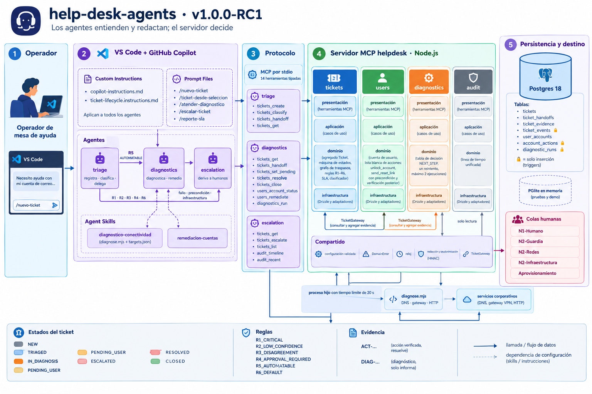
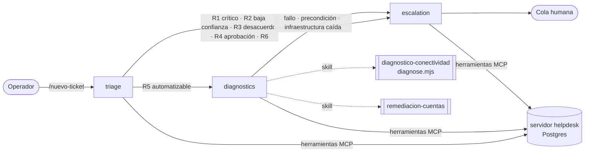
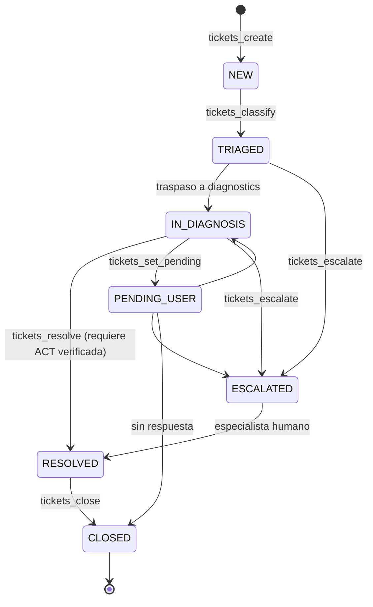

# Ecosistema de agentes para mesa de ayuda

**Autor:** [Adrián Suárez](https://github.com/adrian-suarez) · Desarrollador full stack, líder técnico y arquitecto de software

**Versión:** v1.0.0-RC1 · 2026-09-26 · [Registro de cambios](CHANGELOG.md) · [Guía de instalación](UPGRADE.md)

Solución de soporte técnico automatizado para VS Code con GitHub Copilot. Tres agentes especializados (`triage`, `diagnostics` y `escalation`) atienden tickets escritos en lenguaje natural. Todas las reglas de negocio viven en un **servidor MCP en Node.js**, con arquitectura limpia y Postgres.

**Idea central:** los agentes entienden al usuario, eligen el procedimiento y redactan las respuestas. El servidor decide todo lo que tiene consecuencias:

- las transiciones de estado;
- el destino de cada traspaso entre agentes;
- las acciones permitidas;
- cuándo un caso está resuelto.

Los agentes no tienen terminal ni acceso a archivos: solo pueden llamar a las herramientas asignadas a su rol. La garantía está en el código, no en las instrucciones.

## Contenido

1. [Arquitectura](#arquitectura)
2. [Cumplimiento del enunciado](#cumplimiento-del-enunciado)
3. [Componentes](#componentes)
4. [Patrones de diseño](#patrones-de-diseño)
5. [Tecnologías y versiones](#tecnologías-y-versiones)
6. [Configuración](#configuración)
7. [Puesta en marcha y despliegue](#puesta-en-marcha-y-despliegue)
8. [Herramientas MCP](#herramientas-mcp)
9. [Scripts y utilidades](#scripts-y-utilidades)
10. [Pruebas](#pruebas)
11. [Evidencias](#evidencias)
12. [Decisiones y compensaciones](#decisiones-y-compensaciones)
13. [Comportamiento ante casos límite](#comportamiento-ante-casos-límite)
14. [Limitaciones conocidas](#limitaciones-conocidas)
15. [Uso de IA en el desarrollo](#uso-de-ia-en-el-desarrollo)

## Arquitectura



### Flujo de un ticket



### Ciclo de vida



### Capas

Cada módulo se organiza en cuatro capas. Las dependencias siempre apuntan hacia el dominio.

| Capa | Contenido | Depende de |
| --- | --- | --- |
| `presentation` | Herramientas MCP y esquemas zod. Solo traducen la entrada y la salida | `application` |
| `application` | Casos de uso: cargar, aplicar la regla, guardar y responder | `domain` y puertos |
| `domain` | Entidades, políticas y puertos. TypeScript puro, sin librerías | Nada |
| `infrastructure` | Repositorios Drizzle, esquemas de tablas y adaptadores | `domain` |

```text
src/
├─ main.ts                          entrada: configuración, base de datos, transporte stdio
├─ app.ts                           raíz de composición: conecta módulos e implementaciones
├─ shared/
│  ├─ domain/                       DomainError, stage-guard
│  ├─ application/ports/            Clock, SensitiveDataPort, TicketGateway
│  ├─ infrastructure/               config/env, db/database, db/seed, security/regex-sensitive-data
│  └─ presentation/mcp/             toolHandler (formato de respuesta MCP)
└─ modules/
   ├─ tickets/
   │  ├─ domain/                    ticket.entity, ticket.constants, ticket-code, rule-classifier
   │  │  ├─ policies/               lifecycle, handoff, routing, sla
   │  │  └─ repositories/           ticket.repository (puerto)
   │  ├─ application/use-cases/     create, classify, handoff, query, update-status, add-evidence
   │  ├─ infrastructure/            ticket.schema, ticket.mapper
   │  │  └─ repositories/           drizzle-ticket, in-memory-ticket
   │  └─ presentation/              ticket.tools, ticket.schemas
   ├─ users/                        misma estructura: policies/remediation, repositories/user-account
   ├─ diagnostics/                  diagnostic.policy, script-diagnostic.runner, repositories/drizzle-diagnostic-run
   └─ audit/                        timeline (puerto de lectura), drizzle-audit.reader
```

## Cumplimiento del enunciado

### Casos de negocio y capacidades (secciones 1.1 y 1.2)

| Requisito | Cómo se cumple en el código | Prueba que lo verifica |
| --- | --- | --- |
| **Tres tipologías** | Taxonomía cerrada en `ticket.constants.ts`: `ACCESS_IDENTITY` (bloqueo, contraseña, MFA, cuenta deshabilitada), `INFRA_SOFTWARE` (VPN, rendimiento, aplicaciones) y `PROVISIONING` (carpetas y repositorios, licencias, cambios de perfil) | *rechaza subtipo que no pertenece a la categoría* |
| **Clasificación y triage** | El LLM propone categoría, subtipo, prioridad, confianza y servicio afectado. `rule-classifier.ts` da una segunda opinión. `routing.policy.ts` decide el destino | *routing.policy (orden de reglas)*, *flujo de triage completo por MCP* |
| **Severidad y SLA** | `sla.policy.ts`: P1 crítica (4 h), P2 alta (8 h), P3 media (24 h) y P4 baja (72 h). Las reglas suben la prioridad ante señales de impacto o urgencia | *las reglas suben la prioridad pero nunca la bajan*, *calcula el vencimiento de SLA según la prioridad* |
| **Entidades** | Usuario afectado (seudonimizado), servicio impactado y criticidad (prioridad y severidad) | *crear: redacta credenciales, seudonimiza y avisa* |
| **Diagnóstico automático** | `diagnostics_run` ejecuta el script de la skill con tiempo límite y un reintento | *con servicios sanos: el problema es del equipo del usuario*, *servicio lento: degradado* |
| **Auto-remediación segura** | Solo acciones de la lista blanca, con precondición y verificación posterior. Una vez por ticket. Nunca sobre un bloqueo de seguridad | *desbloquea una cuenta bloqueada por intentos y permite resolver*, *no desbloquea un bloqueo de seguridad y sugiere escalar* |
| **Seguridad y privacidad** | Redacción de secretos y datos personales antes de guardar, seudónimos HMAC y rechazo de datos sensibles en los mensajes al usuario (`SENSITIVE_OUTPUT`) | *nunca guarda el texto original con la credencial*, *bloquea datos personales en el mensaje al usuario* |
| **Escalamiento** | Reglas R1–R4 y R6, fallos de diagnóstico o remediación y `NOT_VERIFIED` llevan el caso a `escalation`, que lo deriva a una de 5 colas humanas | *solo escalation escala, y con cola y mensaje* |
| **Trazabilidad** | Cada cambio guarda un evento en la misma transacción. `audit_timeline` une eventos, remediaciones y diagnósticos. La base rechaza `UPDATE` y `DELETE` en la bitácora | *cada cambio genera un evento de bitácora*, *la base de datos impide modificar o borrar la bitácora* |
| **Comunicación** | Mensajes predefinidos sin jerga en `NEXT_STEP`. Instrucciones de tono con la estructura "qué entendimos, qué hicimos, qué sigue" | Revisión en la demo (`npm run demo`) |

### Requerimientos técnicos (sección 2)

| Requisito | Dónde | Cómo se garantiza | Prueba |
| --- | --- | --- | --- |
| **2.1 Custom Instructions** | `.github/copilot-instructions.md`, `.github/instructions/ticket-lifecycle.instructions.md` (`applyTo: "**"`) | Tabla de transiciones, campos obligatorios por cambio y condición de resuelto. Las mismas reglas están en `lifecycle.policy.ts` y en la entidad `Ticket`: si el modelo las ignora, el servidor rechaza la operación | *rechaza transiciones no definidas*, *las instrucciones del ciclo de vida se aplican a todo el workspace* |
| **2.2 Agent Skills** | `.github/skills/diagnostico-conectividad/` y `.github/skills/remediacion-cuentas/` | Procedimiento de 4 pasos con tabla de decisión. Recurso auxiliar `scripts/diagnose.mjs` (DNS, gateway y salud y latencia HTTP). Criterios de activación en `description`. Manejo de fallos: códigos de salida explícitos, tiempo límite, un reintento y `DIAGNOSTIC_TOOL_UNAVAILABLE` | *script inexistente o timeout: fallo del recurso*, *recupera con un reintento si el script falla una vez*, *si falla dos veces no inventa*, *las skills cumplen el estándar* |
| **2.3 Custom Agents y Handoffs** | `.github/agents/*.agent.md` | 3 agentes con `tools` explícitas y `handoffs` declarados. El servidor valida el dueño, el grafo sin ciclos (`HANDOFF_GRAPH`), el máximo de 2 saltos y que el destino coincida con el enrutamiento. Cada destino recibe solo los campos que necesita | *impide devolver el ticket (ciclo)*, *impide desviarse del enrutamiento*, *los handoffs de cada agente son exactamente los del grafo del dominio*, *cada agente tiene solo las herramientas de escritura que le corresponden* |
| **2.4 Prompt Files** | `.github/prompts/*.prompt.md` | 5 flujos bajo demanda con `${input:nombre:ejemplo}`, `${selection}` y `#tool:helpdesk/…` | *agentes y prompts solo citan herramientas que existen en el servidor* |
| **Node.js** | Todo el servidor, el script y las pruebas | Node 22.12 o superior, TypeScript ejecutado con `tsx` | — |

## Componentes

| Componente | Responsabilidad | Archivos clave |
| --- | --- | --- |
| **tickets** | Ciclo de vida, clasificación híbrida, enrutamiento, traspasos, SLA, evidencia y bitácora | `domain/ticket.entity.ts`, `domain/policies/*`, `infrastructure/repositories/drizzle-ticket.repository.ts` |
| **users** | Directorio simulado y remediación de cuentas de lista blanca | `domain/policies/remediation.policy.ts`, `application/remediate-account.use-case.ts` |
| **diagnostics** | Ejecución de la skill con reintento y tabla de decisión | `domain/diagnostic.policy.ts`, `infrastructure/script-diagnostic.runner.ts` |
| **audit** | Línea de tiempo unificada, de solo lectura | `infrastructure/drizzle-audit.reader.ts` |
| **shared** | Configuración, conexión, errores, puertos comunes, redacción y formato de respuesta MCP | `infrastructure/config/env.ts`, `infrastructure/security/regex-sensitive-data.adapter.ts`, `presentation/mcp/tool-response.ts` |
| **Integración VS Code** | Instrucciones, agentes, skills y prompts | `.github/`, `.vscode/mcp.json` |

**Reglas de enrutamiento** (se evalúan en orden y gana la primera que se cumple):

| Regla | Condición | Destino | Cola |
| --- | --- | --- | --- |
| `R1_CRITICAL` | Prioridad P1 | escalation | N2-Guardia |
| `R2_LOW_CONFIDENCE` | Confianza menor a 0,6 | escalation | N1-Humano |
| `R3_DISAGREEMENT` | Las reglas detectan otro subtipo | escalation | N1-Humano |
| `R4_APPROVAL_REQUIRED` | Categoría de aprovisionamiento | escalation | Aprovisionamiento |
| `R5_AUTOMATABLE` | Cuenta bloqueada, contraseña, VPN o rendimiento | diagnostics | — |
| `R6_DEFAULT` | Cualquier otro caso | escalation | N1-Humano |

**Tipos de evidencia:**

- **`ACT-{id}`:** la genera `users_remediate` y queda verificada solo si la verificación posterior confirma el cambio. Es la única evidencia que permite resolver.
- **`DIAG-{id}`:** la genera `diagnostics_run`. Informa, pero nunca resuelve.

## Patrones de diseño

| Patrón | Dónde | Para qué |
| --- | --- | --- |
| Arquitectura limpia (puertos y adaptadores) | Cuatro capas por módulo | Reglas de negocio independientes de MCP, Drizzle y Postgres |
| Monolito modular | `src/modules/*` | Módulos con límites claros; solo se comunican a través de puertos |
| Agregado | `Ticket` | Un único punto de cambio que aplica todas las políticas y registra eventos |
| Repositorio | `TicketRepository`, `UserAccountRepository`, `DiagnosticRunRepository` | Persistencia intercambiable (Drizzle o memoria) |
| Objeto de valor | `TicketCode` | Formato y validación del código `T-0001` en un solo lugar |
| Raíz de composición | `src/app.ts` | Inyección de dependencias manual, sin framework, y sustituciones en las pruebas |
| Reglas ordenadas | `routing.policy.ts` | Mismo ticket, misma decisión: el destino no depende del modelo |
| Tabla de decisión | `NEXT_STEP` | Mismo diagnóstico, mismo siguiente paso y mismo mensaje |
| Máquina de estados | `lifecycle.policy.ts` | Rechazo de cualquier transición no declarada |
| Lista blanca | `ACTION_DEFINITIONS` | Solo se ejecutan acciones conocidas, con precondición y verificación posterior |
| Bloqueo optimista | Columna `version` | Detecta que dos agentes modifican el mismo ticket a la vez (`CONCURRENT_UPDATE`) |
| Bitácora transaccional | `DrizzleTicketRepository.save` | El cambio y su evento se guardan juntos o no se guarda ninguno |
| Modelo de lectura (CQRS) | Módulo `audit` | Consulta tablas de varios módulos sin modificarlas |
| DTO y mapper | `ticket.dto.ts`, `ticket.mapper.ts` | Controlar qué ve el modelo y separar el dominio de las columnas |
| Validación en el borde | Esquemas zod en `presentation` | Rechaza valores inventados antes de llegar al caso de uso |
| Falla al arrancar | `loadEnv` | Una configuración inválida detiene el servidor con un mensaje claro |

## Tecnologías y versiones

| Pieza | Versión | Uso |
| --- | --- | --- |
| Node.js | 22.12 o superior (probado en 24.15) | Entorno de ejecución |
| TypeScript | 7.0.2 | Verificación de tipos (`tsc --noEmit`) |
| tsx | 4.23.15 | Ejecuta TypeScript sin compilación previa |
| @modelcontextprotocol/server | 2.1.0 | Servidor MCP (SDK v2) |
| @modelcontextprotocol/client | 2.1.0 | Cliente MCP de la demo y de las pruebas de punta a punta |
| zod | 4.6.5 | Validación de configuración y de la entrada de las herramientas |
| drizzle-orm | 0.45.3 | Consultas con tipos y transacciones |
| drizzle-kit | 0.31.11 | Generación y aplicación de migraciones |
| postgres (postgres.js) | 3.4.9 | Controlador de Postgres |
| @electric-sql/pglite | 0.5.8 | Postgres embebido para las pruebas y el modo sin Docker |
| Postgres | 18 (`postgres:18-alpine`) | Base de datos |
| node:test | Incluido en Node.js | Ejecutor de pruebas, sin dependencias extra |

## Configuración

| Variable | Obligatoria | Por defecto | Descripción |
| --- | :-: | --- | --- |
| `DATABASE_URL` | Sí | — | `postgres://…` o `pglite://memory` |
| `PSEUDONYM_SALT` | Sí | — | Sal del HMAC de seudónimos (16 caracteres o más) |
| `DIAGNOSTIC_SCRIPT` | No | Script de la skill | Ruta al script de diagnóstico |
| `DIAGNOSTIC_TIMEOUT_MS` | No | `20000` | Tiempo límite por ejecución (1000 a 60000) |

Los parámetros de Docker, del diagnóstico (`targets.json`) y de los servicios simulados están en [UPGRADE.md](UPGRADE.md).

## Puesta en marcha y despliegue

**Requisitos:** Node.js 22.12 o superior, Docker y VS Code con GitHub Copilot.

```bash
npm ci
cp .env.example .env
npm run setup          # Postgres 18 en Docker, migraciones y cuentas demo
npm test               # 54 pruebas
npm run demo           # 7 escenarios de punta a punta por MCP
```

**Sin Docker:** en `.env`, `DATABASE_URL=pglite://memory`. Postgres corre embebido y aplica las migraciones y las cuentas demo en cada arranque. Los datos se borran al cerrar.

**En VS Code:**

1. Abre la carpeta. `.vscode/mcp.json` registra el servidor `helpdesk`: ábrelo y pulsa **Start**.
2. En otra terminal, ejecuta `npm run mock:services` para levantar los servicios corporativos simulados que usa el diagnóstico.
3. En el chat, escribe `/nuevo-ticket` o elige el agente **triage** y pega el mensaje del usuario.
4. Después del triage aparece el botón de traspaso hacia el siguiente agente.

**Cuentas demo:**

| Usuario | Estado | Qué demuestra |
| --- | --- | --- |
| `jperez` | Bloqueada por intentos fallidos | Desbloqueo automático y resolución con evidencia |
| `acastro` | Bloqueo de seguridad | La remediación se niega y el caso se escala |
| `mgarcia` | Deshabilitada por inactividad | Sin procedimiento automático: se escala |
| `lrodriguez` | Activa | Diagnóstico de VPN con la infraestructura sana |

**Para simular fallos:** `MOCK_NO_GATEWAY=1 npm run mock:services` (gateway caído) o `MOCK_SLOW=erp npm run mock:services` (servicio lento). Sin los servicios levantados, el gateway aparece inalcanzable.

## Herramientas MCP

| Herramienta | triage | diagnostics | escalation | Tipo |
| --- | :-: | :-: | :-: | --- |
| `tickets_create`, `tickets_classify` | ✓ | | | Escritura |
| `tickets_handoff` | ✓ | ✓ | | Escritura |
| `tickets_get` | ✓ | ✓ | ✓ | Lectura |
| `tickets_set_pending`, `tickets_resolve`, `tickets_close` | | ✓ | | Escritura |
| `users_account_status` | | ✓ | | Lectura |
| `users_remediate`, `diagnostics_run` | | ✓ | | Escritura |
| `tickets_escalate` | | | ✓ | Escritura |
| `tickets_list`, `audit_timeline`, `audit_recent` | | | ✓ | Lectura |

**Formato de respuesta:**

- Todas las respuestas llevan `ok`.
- Cuando hay un siguiente paso obligatorio, la respuesta incluye `next: { tool, args }`.
- Los errores de negocio llegan con `isError` y un `code` estable.

| Código | Significado |
| --- | --- |
| `NOT_OWNER` | El agente no es el dueño actual del ticket |
| `ROUTING_MISMATCH` | El traspaso no coincide con el destino que fijó el enrutamiento |
| `FORBIDDEN_HANDOFF`, `CYCLE_DETECTED`, `MAX_HANDOFFS` | Traspaso fuera del grafo, repetido o por encima del límite |
| `INVALID_TRANSITION`, `MISSING_FIELD` | Cambio de estado no permitido o campo obligatorio vacío |
| `NOT_VERIFIED` | Se intentó resolver sin una acción verificada |
| `SENSITIVE_OUTPUT` | El mensaje al usuario contiene datos personales o secretos |
| `ALREADY_ATTEMPTED` | La acción de remediación ya se intentó en este ticket |
| `WRONG_STAGE`, `NOT_ALLOWED`, `NOT_APPLICABLE` | Acción fuera de la etapa, del agente o del subtipo correspondiente |
| `MAX_RUNS` | Se alcanzó el máximo de diagnósticos por ticket |
| `CONCURRENT_UPDATE` | Otro proceso modificó el ticket al mismo tiempo |
| `INTERNAL_ERROR` | Error inesperado: se registra en el servidor y el agente solo recibe un mensaje genérico |

## Scripts y utilidades

| Comando | Qué hace |
| --- | --- |
| `npm run dev` | Arranca el servidor MCP por stdio con `.env` |
| `npm run inspect` | Abre el servidor en MCP Inspector para probar herramientas a mano |
| `npm run typecheck` | Verifica los tipos con `tsc` |
| `npm test` | Ejecuta las 54 pruebas |
| `npm run setup` | `db:up` + `db:migrate` + `db:seed` |
| `npm run db:up` / `db:down` | Levanta o detiene Postgres en Docker |
| `npm run db:generate` / `db:migrate` | Genera o aplica migraciones |
| `npm run db:seed` | Carga las cuentas demo (idempotente) |
| `npm run db:studio` | Abre Drizzle Studio para explorar la base |
| `npm run demo` | Ejecuta los 7 escenarios de `tools/demo.ts` |
| `npm run mock:services` | Levanta los servicios corporativos simulados |

**Escenarios de la demo:**

1. Cuenta bloqueada en la que el usuario comparte su contraseña.
2. VPN que no conecta con la infraestructura sana.
3. Gateway VPN sin respuesta.
4. Bloqueo de seguridad.
5. Acceso a un repositorio que requiere aprobación.
6. Incidente masivo en el que las reglas suben la prioridad.
7. Controles que el servidor rechaza.

## Pruebas

54 pruebas con `node:test`, sin servicios externos: las que usan base de datos corren sobre PGlite.

| Archivo | Tipo | Qué cubre |
| --- | --- | --- |
| `test/unit/ticket-domain.test.ts` | Unitaria | Máquina de estados, orden de las reglas de enrutamiento, clasificador por reglas, grafo de traspasos, SLA y eventos |
| `test/unit/ticket-use-cases.test.ts` | Unitaria | Casos de uso con el repositorio en memoria: redacción, flujo completo, permisos, datos personales, concurrencia y SLA vencido |
| `test/unit/github-config.test.ts` | Coherencia | Que agentes, prompts, skills e instrucciones coincidan con el servidor |
| `test/integration/drizzle-ticket.repository.test.ts` | Integración | Persistencia real, bloqueo optimista y que nunca se guarde la credencial original |
| `test/integration/users-diagnostics-audit.test.ts` | Integración | Remediación, diagnóstico con reintento, línea de tiempo y bitácora inmutable |
| `test/integration/diagnose-script.test.ts` | Integración | El script real contra los servicios simulados, incluido el fallo del recurso |
| `test/e2e/mcp-server.test.ts` | Punta a punta | Cliente MCP por stdio: herramientas expuestas, flujos completos, validación de esquemas y códigos de error |

## Evidencias

Capturas de una ejecución real en VS Code con GitHub Copilot y Postgres 18 en Docker. Muestran el ticket `T-0008` ("no sirve la vpn") recorriendo los tres agentes hasta la cola humana.

| Paso | Qué muestra | Captura |
| --- | --- | --- |
| 1. Arranque | El servidor `helpdesk` inicia desde `mcp.json` y VS Code descubre las 14 herramientas | [Ver](docs/evidences/01-servidor-mcp-14-herramientas.png) |
| 2. Preparación | `npm run setup`: Postgres 18 saludable, migraciones aplicadas y cuentas demo | [Ver](docs/evidences/02-npm-run-setup-docker.png) |
| 3. Triage | `/nuevo-ticket`: clasificación `VPN_CONNECTIVITY` P2, regla `R5_AUTOMATABLE` y traspaso a diagnostics | [Ver](docs/evidences/03-triage-nuevo-ticket.png) |
| 4. Base de datos | El ticket queda en `IN_DIAGNOSIS` con dueño `diagnostics` y usuario seudonimizado | [Ver](docs/evidences/04-bd-ticket-en-diagnostico.png) |
| 5. Diagnóstico | El agente consulta el ticket y recibe solo el contexto necesario | [Ver](docs/evidences/05-diagnostics-consulta-ticket.png) |
| 6. Diagnóstico | `diagnostics_run` devuelve `GATEWAY_UNREACHABLE` con evidencia `DIAG-3` y el siguiente paso | [Ver](docs/evidences/06-diagnostics-ejecuta-diagnostico.png) |
| 7. Traspaso | Resultado para el usuario y botón **Escalar a atención humana** | [Ver](docs/evidences/07-diagnostics-resultado-boton-escalar.png) |
| 8. Base de datos | El dueño cambia a `escalation` | [Ver](docs/evidences/08-bd-ticket-traspasado-a-escalation.png) |
| 9. Escalamiento | VS Code pide confirmación antes de ejecutar la herramienta de escritura | [Ver](docs/evidences/09-escalation-confirma-herramienta.png) |
| 10. Escalamiento | `tickets_escalate` a la cola `N2-Redes`, con mensaje sin jerga para el usuario | [Ver](docs/evidences/10-escalation-tickets-escalate.png) |
| 11. Escalamiento | Resumen para el operador: prioridad, SLA, diagnóstico y acción requerida | [Ver](docs/evidences/11-escalation-resumen-operador.png) |
| 12. Bitácora | `ticket_events`: cada decisión, con actor, estado anterior y nuevo | [Ver](docs/evidences/13-bd-ticket-events-bitacora.png) |
| 13. Evidencia | `ticket_evidence`: `ACT-1` verificada y `DIAG-…` solo informativas | [Ver](docs/evidences/14-bd-ticket-evidence.png) |
| 14. Traspasos | `ticket_handoffs`: todos avanzan, sin retornos | [Ver](docs/evidences/15-bd-ticket-handoffs.png) |
| 15. Diagnósticos | `diagnostic_runs`: detalle de las comprobaciones (DNS, gateway, HTTP) | [Ver](docs/evidences/16-bd-diagnostic-runs-detalle.png) |

## Decisiones y compensaciones

| Decisión | Qué gano | Qué cedo |
| --- | --- | --- |
| Herramientas MCP en lugar de terminal | Cada agente ve solo sus herramientas, con parámetros tipados y listas cerradas | Hay que mantener un servidor y declarar cada acción de forma explícita |
| Clasificación híbrida (LLM y reglas) | El modelo entiende sinónimos y errores de escritura; las reglas detectan desacuerdos | Algunos casos correctos se escalan por precaución |
| El servidor decide el destino del traspaso | Comportamiento predecible y verificable con pruebas | El modelo no puede usar su criterio para desviar un caso |
| Solo una acción verificada resuelve | Nadie puede declarar resuelto un ticket sin pruebas | Menos casos se cierran de forma automática |
| Un solo reintento del diagnóstico | Respuesta rápida y sin bucles | Un fallo transitorio más largo termina en manos de una persona |
| Postgres con bitácora de solo inserción | Consistencia, transacciones y auditoría garantizada por la base | Requiere Docker, o PGlite para evaluarlo sin instalar nada |
| Inyección de dependencias manual | Código explícito y fácil de seguir, sin magia de un framework | Más código de conexión en `app.ts` |
| Redacción por patrones | Simple, rápida y sin dependencias externas | Puede no detectar formatos poco comunes |

## Comportamiento ante casos límite

| Situación | Qué hace el sistema |
| --- | --- |
| El modelo clasifica mal | Las reglas dan una segunda opinión; si no coinciden o la confianza es menor a 0,6, pasa a una persona |
| Inventa una categoría, cola o estado | El esquema lo rechaza antes de llegar al caso de uso (listas cerradas) |
| Intenta enviar el ticket a otro agente | `ROUTING_MISMATCH`: el destino lo fija el enrutamiento, no el modelo |
| Intenta resolver sin haber hecho nada | `NOT_VERIFIED`: solo resuelve una acción `ACT-…` verificada por el servidor |
| El usuario escribe su contraseña | Se redacta antes de guardar y se le recomienda cambiarla |
| El texto trae instrucciones maliciosas | El servidor solo actúa sobre el usuario del ticket, con acciones de la lista blanca y nunca sobre un bloqueo de seguridad |
| El script de diagnóstico no responde | Tiempo límite, un reintento y escalamiento; no se inventa un resultado |
| Dos agentes modifican el mismo ticket | `CONCURRENT_UPDATE` por bloqueo optimista |
| Alguien intenta alterar la bitácora | La base de datos rechaza `UPDATE` y `DELETE` |
| Riesgo de ciclos entre agentes | El grafo solo avanza, no repite agentes y admite 2 saltos como máximo; `escalation` termina en una cola humana |
| Caso crítico (P1) o ambiguo | Va directo a una persona, aunque sea automatizable |

**Para extenderlo:**

- **Un tipo de ticket nuevo:** se agrega en `TAXONOMY`.
- **Un agente nuevo:** su `.agent.md` más una arista en `HANDOFF_GRAPH`.
- **Un conector real (por ejemplo, Entra ID):** se implementa detrás del puerto existente.

**Por qué sin un framework de agentes:** VS Code ya aporta los agentes, los traspasos y las skills. Faltaba un lugar confiable para las reglas, y ese papel lo cumple el servidor MCP.

**Para llevarlo a producción:** conectores reales, redacción con un servicio especializado, autenticación del operador, alertas de SLA y transporte HTTP.

## Limitaciones conocidas

| Limitación | Qué significa | Cómo se mejoraría |
| --- | --- | --- |
| Detección de datos sensibles por patrones | Reconoce contraseñas, correos o teléfonos con formatos habituales, pero un formato raro podría pasar sin ocultarse | Usar un servicio especializado, como Microsoft Presidio |
| El modelo lee el mensaje original | El servidor oculta los datos sensibles antes de guardarlos, pero el modelo ya vio el texto completo | Ocultar los datos antes de que el mensaje llegue al chat |
| El agente dice quién es | Cada llamada indica qué agente la hace, y ese dato lo escribe el propio modelo | El control real ya existe: cada agente solo tiene acceso a sus herramientas |
| Remediación y evidencia en dos pasos | Si falla el segundo paso, la acción queda registrada, pero no aparece en el ticket | Guardar ambas cosas en una sola operación |
| Los tickets no se pueden borrar | La bitácora es inmutable, así que un ticket con historial no puede eliminarse | Es intencional: en auditoría no se borra, se cierra |
| Usuarios y servicios simulados | El directorio de cuentas y los servicios corporativos son de prueba | Conectar Entra ID o ServiceNow detrás de los mismos puertos |

## Uso de IA en el desarrollo

Durante el desarrollo usé asistentes de IA como apoyo para escribir código, pruebas y documentación. El enfoque, las decisiones de diseño y la validación del resultado son míos: revisé el código, ejecuté las pruebas y probé la solución de punta a punta en VS Code.

---

<p align="center">
  <strong>Adrián Suárez</strong><br/>
  Desarrollador full stack · Líder técnico · Arquitecto de software<br/>
  <a href="mailto:adriansuarezucv@gmail.com">adriansuarezucv@gmail.com</a> · <a href="https://github.com/adrian-suarez">github.com/adrian-suarez</a>
</p>
